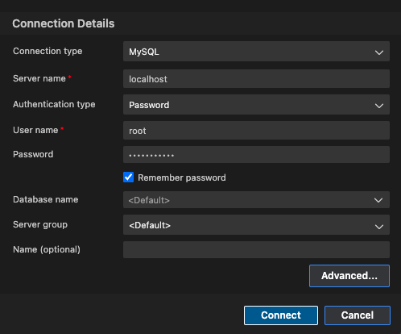
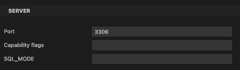

### Connect from the terminal

1. Navigate to the docker folder:

```sh
cd docker
```

2. Initialize the container using Docker Compose:

```sh
docker-compose up --build -d
```

3. Connect to the MySQL database:

```sh
docker exec -it docker-db-1 mysql -u root -p
```

3. To exit from the MySQL prompt:

```sh
exit;
```

### Connect from Azure Data Studio

1. Install MySQL extension

2. Create a new connection





2. Click "Connect" to establish the connection
